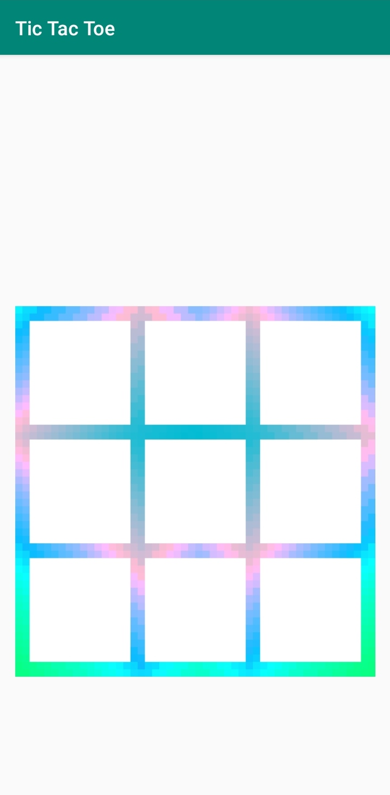
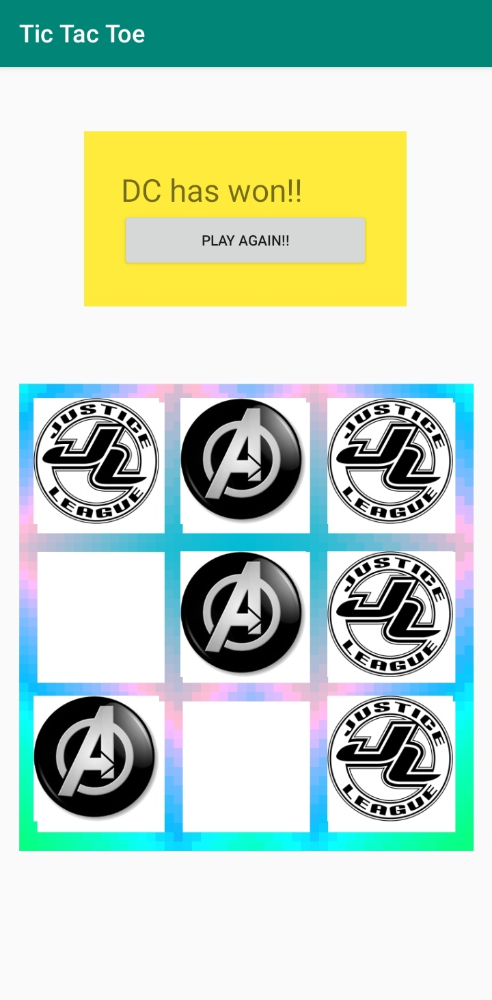
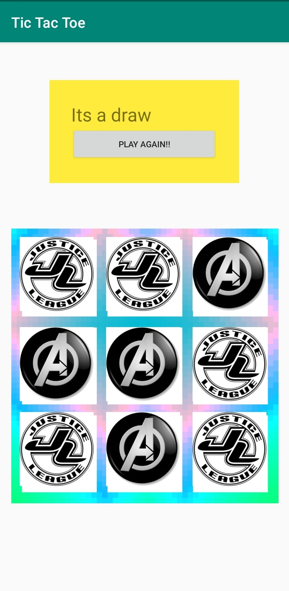

# Tic-Tac-Toe-Android-Project

This is my version of Tic tac toe with the symbols of avengers and Dc instead of X and 0's.
On orientation change there is an error that the game restarts also play again button makes the app crash which needs to be fixed
 
## Example Pictures

 
 
 

## Download

## Developer
Gaurav Raj - [LinkedIn](https://www.linkedin.com/in/gaurav-raj-5893b0195/)
